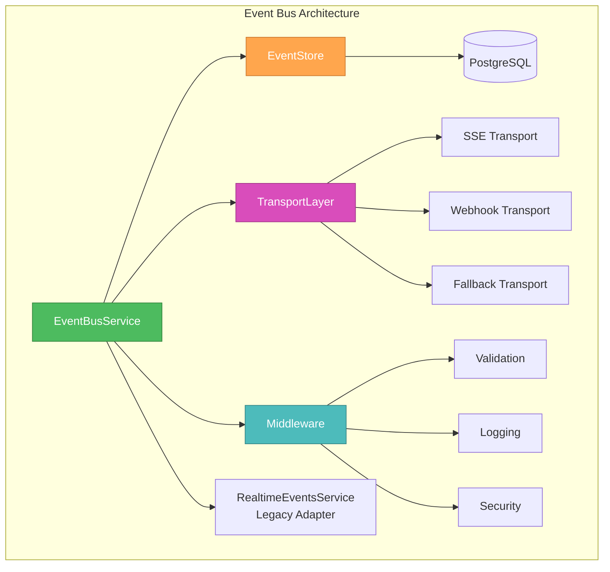

# Event Bus Final Architecture - CREATIVE Phase Summary

## 🏗️ Architecture Overview

Based on the creative phase analysis, the Event Bus architecture has been designed with the following key decisions:

### Core Architecture Decision

**Selected**: New EventBus with Adapter Pattern

- **Rationale**: Optimal balance of development speed, compatibility, and future scalability
- **Implementation**: EventBusService as wrapper around RealtimeEventsService

### Component Architecture

## 📋 Key Design Decisions

### 1. Event Store Design

- **Selected**: Single Events Table with Smart Indexing
- **Rationale**: Best balance of simplicity and performance for current scale
- **Features**: JSON payload, composite indexes, table partitioning

### 2. Transport Layer

- **Selected**: Universal Transport with Smart Fallback
- **Rationale**: Maximum compatibility and reliability
- **Components**: SSE primary, Webhooks secondary, Polling fallback

### 3. Middleware System

- **Selected**: Pipeline Pattern with Conditional Middleware
- **Rationale**: Optimal balance of performance, flexibility, and maintainability
- **Features**: Configurable pipeline, conditional execution, circuit breakers

### 4. Event Types System

- **Selected**: Schema-driven Types with Class Validation
- **Rationale**: Best combination of type safety, documentation, and maintainability
- **Features**: JSON Schema, TypeScript generation, runtime validation

### 5. Integration Strategy

- **Selected**: Adapter Bridge Pattern with Gradual Enhancement
- **Rationale**: Lowest risk approach with immediate value
- **Features**: Zero-downtime migration, feature flags, rollback capability

### 6. Performance Optimization

- **Selected**: Hybrid Processing with Smart Routing
- **Rationale**: Optimal balance of latency and throughput
- **Features**: Critical events sync, others async, priority routing

### 7. Monitoring System

- **Selected**: Hybrid Monitoring with Enhanced health-monitor.js
- **Rationale**: Leverages existing infrastructure with comprehensive monitoring
- **Features**: Custom metrics, health checks, operational dashboard

## 🔧 Implementation Strategy

### Phase 1: Foundation (Weeks 1-2)

1. Create EventBusService as adapter around RealtimeEventsService
2. Implement basic Event Store with PostgreSQL
3. Add core middleware (validation, logging, security)
4. Maintain existing SSE endpoints

### Phase 2: Enhancement (Weeks 3-4)

1. Implement Transport Layer with fallback mechanisms
2. Add Event Types system with schema validation
3. Create monitoring and health check endpoints
4. Add performance optimization features

### Phase 3: Integration (Weeks 5-6)

1. Integrate with existing modules (Projects, Users, Integrations)
2. Add webhook system for external integrations
3. Implement plugin system compatibility
4. Add comprehensive testing

### Phase 4: Production (Weeks 7-8)

1. Performance tuning and optimization
2. Security audit and hardening
3. Documentation and training
4. Production deployment and monitoring

## 📊 Expected Outcomes

### Performance Targets

- **Throughput**: 100+ events per second
- **Latency**: <100ms event delivery
- **Concurrent Connections**: 100+ SSE connections
- **Memory Usage**: <500MB
- **Database Queries**: <50ms

### Quality Targets

- **Uptime**: 99.9%
- **Test Coverage**: 90%+
- **Type Safety**: 100% TypeScript coverage
- **Documentation**: Complete API and developer guides
- **Security**: Passed security audit

## 🚀 Next Steps

1. **IMPLEMENT Mode**: Begin implementation of Phase 1
2. **Create Implementation Tasks**: Break down into specific development tasks
3. **Setup Development Environment**: Prepare Event Bus development workspace
4. **Begin Core Implementation**: Start with EventBusService and Event Store

## ✅ Verification Checklist

- [x] All system requirements addressed
- [x] Component responsibilities defined
- [x] Interfaces specified
- [x] Data flows documented
- [x] Security considerations addressed
- [x] Scalability requirements met
- [x] Performance requirements met
- [x] Maintenance approach defined
- [x] Integration strategy planned
- [x] Monitoring system designed
- [x] Risk assessment completed
- [x] Implementation roadmap created

**CREATIVE Phase Status**: ✅ **COMPLETED**

Ready to proceed to **IMPLEMENT Mode** for Event Bus development.
